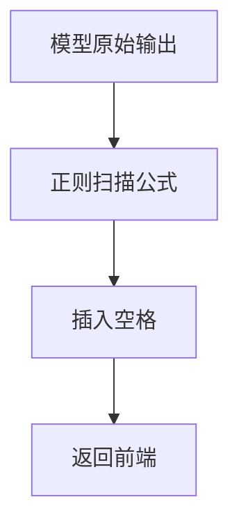

# Open WebUI Functions

面向 **Open WebUI ≥ 0.5.x** 的两款扩展：一款聚焦公式可读性（Filter），一款提升 DeepSeek‑R1 RagFlow API 思维链输出的可读性（Pipe）。二者可独立启用，也可组合使用，构建更清晰、更友好的对话体验。

---

## 目录
1. [功能速览](#功能速览)  
2. [LaTeX Display Optimization (Filter)](#latex-display-optimization.py)  
3. [RagFlow DeepSeek CoT Optimizer (Pipe)](#ragflow-deepseek-cot-optimizer.py)  
4. [安装与启用](#安装与启用)  
5. [配置示例](#配置示例)   
6. [贡献须知](#贡献须知)  
7. [许可证](#许可证)

---

## 功能速览

| 名称 | 类型 | 适配版本 | 作用 |
|------|------|----------|------|
| **LaTeX Display Optimization** | Filter | ≥ 0.4.0 | 检测并为 LaTeX 公式两侧自动插入空格，提升公式与正文的视觉分离度 |
| **RagFlow DeepSeek CoT Optimizer** | Pipe   | ≥ 0.5.6 | 将 `<think>…</think>` 片段转写为 Markdown 代码块（```Reasoning…```），令长链式思考与主回答区分，更易阅读与折叠 |

---

## LaTeX Display Optimization (Filter)

### 特性
- **格式全覆盖**：支持 `$$...$$`、`$...$`、`$begin:math:display$...$end:math:display$`、`$begin:math:text$...$end:math:text$`。
- **零侵入**：仅做渲染层改写，不影响模型输出内容本身。
- **随开随关**：通过 Valve 字段 `enabled` 快速切换。

### 工作原理


|原始|处理后|
|---|---|
|这是面积$S=\\pi r^2$的表达式|这是面积 $S=\\pi r^2$ 的表达式|


⸻

RagFlow DeepSeek CoT Optimizer (Pipe)

核心能力

	1.	思维链分离
	•	捕获流式响应中的 <think> / </think> 标签。
	•	首次遇到 <think> ➜ 写入 \n\``Reasoning…\n`，并将后续原始思考写入同一代码块。
	•	闭合 </think>（流尾或检测到“最后一个”时） ➜ 写入 \n\``\n` 结束代码块。
 
	2.	行内去噪
	•	移除多余 <think> 或残留字符串（如 /think>, hink> 等），防止碎片渗入主回答。
 
	3.	异常兜底
	•	流式请求异常或 JSON 解码失败时，将缓冲区全部强制处理后输出，并返回格式化错误信息。

效果示例

User: 请给我一个示例
Assistant: 
```Reasoning...
1. 查找数据库
2. 过滤重复
3. 生成摘要
```
最终答案：这是示例。


源码概览

文件：ragflow_deepseek_cot_optimizer.py

	•	Pipe.Valves 负责 API 连接参数
	•	pipe() 负责流式转写及错误处理
	•	_transform_chunk() 为核心转换器
	•	其他辅助函数：状态推送、异常格式化等

⸻

安装与启用

### 1. 访问 GitHub 仓库或 Open WebUI 官网，将代码复制、克隆到Open WebUI

| 插件名称 | 源代码(GitHub) | 官网链接 |
| --- | --- | --- |
| LaTeX Display Optimization | [latex_display_optimization.py](latex_display_optimization.py) | [latex_display_optimization](https://openwebui.com/f/krisham/latex_display_optimization) |
| RagFlow DeepSeek CoT Optimizer | [ragflow_deepseek_cot_optimizer.py](ragflow_deepseek_cot_optimizer.py) | [ragflow_deepseek_cot_optimizer](https://openwebui.com/f/krisham/ragflow_deepseek_cot_optimizer) |

### 2. 在 WebUI → Admin Settings › Functions 中：

	•	勾选 Enabled 开关
	•	点击 Configure 调整 Valve 字段

⸻

配置示例

### LaTeX Display Optimization
enabled: true      # 全局开关

### RagFlow DeepSeek CoT Optimizer
API_BASE_URL: "https://api.siliconflow.com/v1"
API_KEY: "sk-xxxxxxxxxxxxxxxxxxxxxxxxxxxxxxxx"
API_MODEL: "deepseek-reasoner"


⸻

贡献须知

	•	Issue 前先检索历史，避免重复。
	•	PR 需通过 flake8、mypy；如影响文档，请同步修改多语言版本。
	•	欢迎提交更多正则模式、兼容其他 CoT 标记或主题样式。

⸻

许可证

本仓库代码以 MIT License 发布。依赖库须遵循各自许可证。

